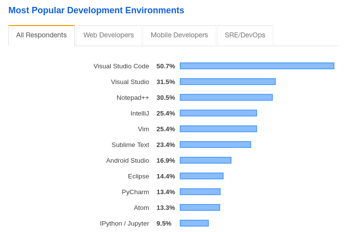
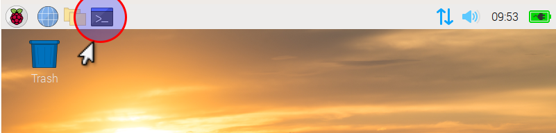

= Visual Studio Code
:icons: font
:source-highlighter: rouge
:toc: left

== Introduction

https://en.wikipedia.org/wiki/Visual_Studio_Code[Visual Studio Code], or short VS Code, is an open source text editor developed from Microsoft.

For languages like Java, programmers usually use an Integrated Development Environment (IDE) which is optimised for the respective environment.
However, there is always the need to edit text files outside of the main project, e.g. https://en.wikipedia.org/wiki/Shell_script[shell scripts], utility scripts with Python, notes and documentation.
Here it may be useful to have another general purpose text editor at hand.

At the moment, VS Code is the most popular of them.

.Source https://insights.stackoverflow.com/survey/2019#technology-_-most-popular-development-environments[Stackoverflow developer survey 2019]

== Setup

VS Code can be installed on a RaspberryPi with the help of the community project https://code.headmelted.com[code.headmelted.com].

=== Open terminal

The first thing we need to do to get it installed is to open a terminal window by clicking on the "Terminal" icon on the desktop.

.Screenshot Raspbian desktop

=== Download and install

Then we can proceed with the download and installation by typing in the following commands into the terminal.

[source, bash]
----
sudo su # <1>
dpkg --configure -a # <2>
. <( wget -O - https://code.headmelted.com/installers/apt.sh ) # <3>
exit # <4>
exit # <5>
----
<1> Start working as super-user (i.e. administrator).
<2> Configure the Debian package manager (`dpkg`). See https://linux.die.net/man/1/dpkg[manual page] for details.
<3> Run the installer script from the project website.
<4> Quit the super-user mode.
<5> Quit the terminal.
