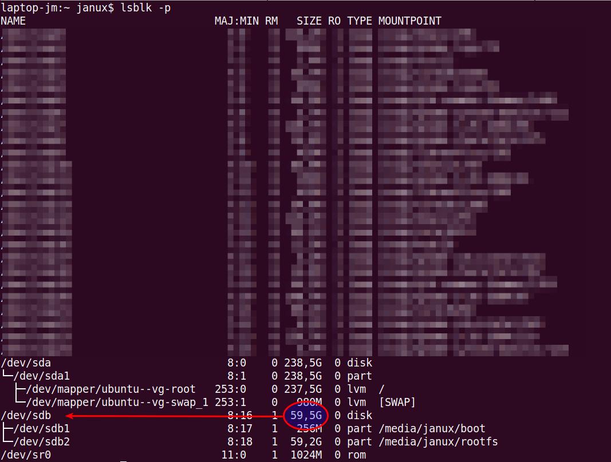
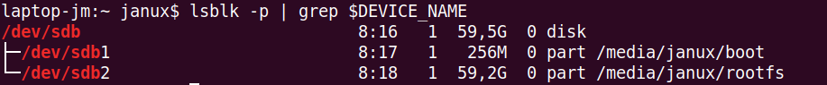

= Installing Raspbian on Linux

This section contains a description for installing https://en.wikipedia.org/wiki/Raspbian[Rasbian] on a micro SD card using with a Linux computer, using the https://en.wikipedia.org/wiki/Command-line_interface[commandline interface].

== Download Rasbian

With the following https://tldr.ostera.io/curl[`curl`] command you can download the latest Rasbian release into the "Downloads" of your home directory "~".
The file size is around 3 https://en.wikipedia.org/wiki/Gigabyte[GB], so you will need a good internet connection and some patience.

[source, bash]
----
curl --location https://downloads.raspberrypi.org/raspbian_full_latest > ~/Downloads/raspbian-latest.zip
----

Afterwards, the downloaded file needs to be unzipped.

[source, bash]
----
unzip ~/Downloads/raspbian-latest.zip -d /tmp
mv /tmp/*-raspbian-*.img /tmp/raspbian-latest.img # <1>
----
<1> With this https://tldr.ostera.io/mv[`mv`] command the IMG file with the Raspian system will be renamed to a filename which doesn't include its version number.

== Locate SD Card

After plugging in the SD card, you need to find out its device name.
This can be done with the help of the https://www.howtoforge.com/linux-lsblk-command/[`lsblk`] command.

[source, bash]
----
lsblk -p
----

One way to determine the correct device name is to find the value matching with the micro SD card in the "SIZE" column.

.Example output for device overview

Now you can store the correct device name in a variable which can the be used in the following steps.

With the help of the https://tldr.ostera.io/grep[`grep`] command you can double check that you have entered the correct value.

[source, bash]
----
lsblk -p | grep $DEVICE_NAME
----

.Example output for check if correct device name was selected

[source, bash]
----
DEVICE_NAME=/dev/sdx
----

== Unmount micro SD card

If the device is https://www.bleepingcomputer.com/tutorials/introduction-to-mounting-filesystems-in-linux/[mounted] into your file system tree, you need to https://www.bleepingcomputer.com/tutorials/introduction-to-mounting-filesystems-in-linux/[unmount] it now with the https://tldr.ostera.io/umount[`umount`] command.

.Test test test
[source, bash]
----
umount $DEVICE_NAME* # <1>
----
<1> The asterisk after the variable is a http://tldp.org/LDP/GNU-Linux-Tools-Summary/html/x11655.htm[wildcard] character which will execute the command for all the partions on the device.

== Copy image to micro SD card

WARNING: The following step will overwrite all existing data on the target device. If you have entered a wrong value in the variable `DEVICE_NAME`, it may lead to a undesired data loss.

Finally, you can copy the Raspbian image on the micro SD card with the https://tldr.ostera.io/dd[`dd`] command. This needs to be prefix with the https://tldr.ostera.io/sudo[`sudo`] command to give `dd` the necessary permissions.

[source, bash]
----
sudo dd bs=4M if=/tmp/raspbian-latest.img of=$DEVICE_NAME status=progress conv=fsync
----

After this is done, you can unplug the micro SD card.

== Resources

- https://www.raspberrypi.org/documentation/installation/installing-images/README.md
- https://www.raspberrypi.org/documentation/setup/
